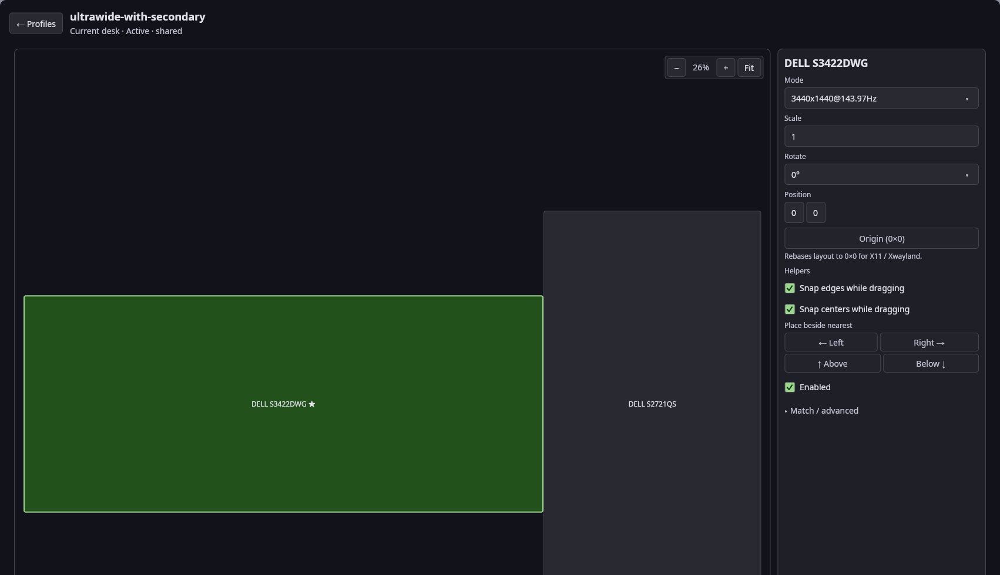
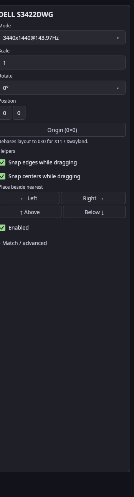
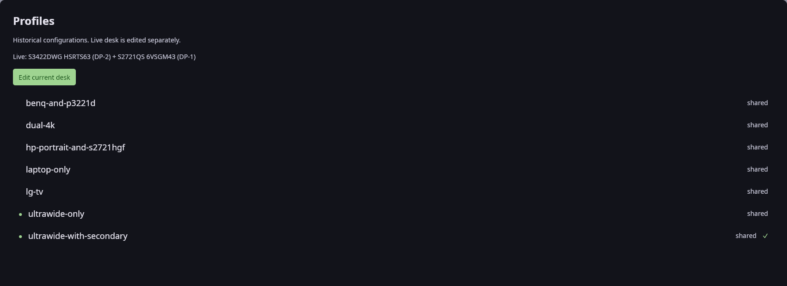

# dials

Desktop settings for Wayland sessions, in [Slint](https://slint.dev) on
[slint-kit](https://github.com/MasonRhodesDev/slint-kit). One window, four
sections:

- **Displays** — canvas-first editor for
  [`monitor-profiles`](https://github.com/MasonRhodesDev/monitor-profiles)
  TOML under `~/.config/hypr/profiles` (and shared `/etc/monitor-profiles`
  for the greeter). Save relies on
  [hyprstate](https://github.com/MasonRhodesDev/hyprstate)'s hot-reload —
  there is no separate Apply.
- **Power** — hyprstate's power policy map, sensors, and overrides.
- **Help** — live graph of how hyprstate derives lid/power/display state.
- **More** — every other settings tool installed on the system, launched in
  its own window.







## Listing a tool under More

Dials does not embed other tools and has no plugin API. It reads XDG desktop
entries (`~/.local/share/applications`, then `$XDG_DATA_DIRS`) and lists an
entry when either holds:

- `Categories=` contains `Settings;` (the freedesktop convention — the same
  entry shows up in LXQt's and Xfce's settings managers), or
- `X-Dials-Section=<section>` is set. It also picks the section; without it
  the section (Appearance, Hardware, Network, System, Other) is derived
  from `DesktopSettings` / `HardwareSettings` / `Network` / `System`.

`NoDisplay`, `Hidden`, `OnlyShowIn` / `NotShowIn` (against
`$XDG_CURRENT_DESKTOP`) and a missing `TryExec` all hide an entry. `Exec`
field codes are dropped; tools are launched in their own process group.
`Terminal=true` entries run under `xdg-terminal-exec`, else `$TERMINAL`;
with neither they are hidden. `dials --entries` prints what More would list.

```ini
[Desktop Entry]
Type=Application
Name=Themes
Exec=kitty lmtt-config
Categories=Settings;DesktopSettings;
X-Dials-Section=Appearance
```

## Run

```sh
cargo run --release
```

Displays and Power need `hyprctl` on `PATH` (Hyprland session) and
hyprstate for apply; More works on any Wayland compositor. Packaged
Fedora/Arch installs put the binary in `/usr/bin` and a Settings desktop
entry in `/usr/share/applications`.

## Releasing

Bump `Cargo.toml`, `packaging/dials.spec` (+ `%changelog`), and
`packaging/PKGBUILD` together, then tag `vX.Y.Z`. CI builds the Arch package,
submits COPR, and dispatches [arch-repo](https://github.com/MasonRhodesDev/arch-repo).
